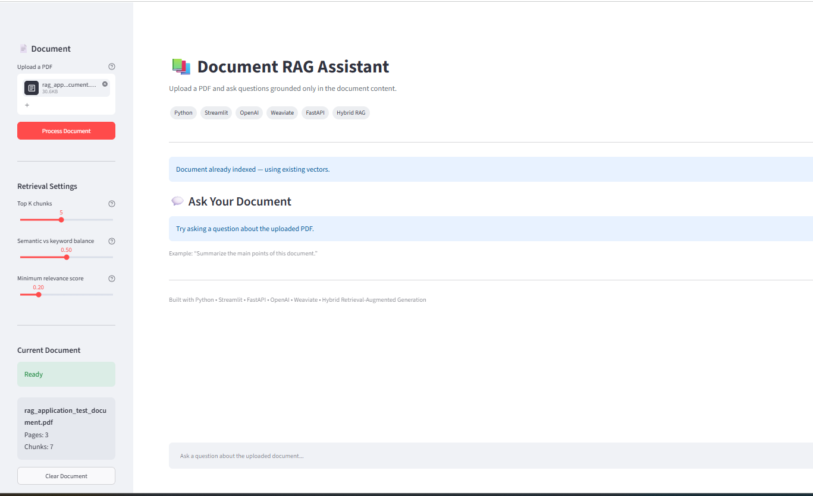

# 📚 Document RAG Assistant

A production-style **Retrieval-Augmented Generation (RAG)** application that allows users to upload PDF documents and ask natural-language questions grounded in the uploaded document.

The application uses **OpenAI embeddings and LLMs**, **Weaviate vector database**, **FastAPI**, and **Streamlit** to provide document-aware question answering with source attribution and relevance filtering.

---

## 🚀 Features

- 📄 Upload and process PDF documents
- ✂️ Automatic document chunking
- 🧠 OpenAI embeddings
- 🔎 Vector and hybrid retrieval using Weaviate
- 💬 Document-grounded question answering
- 📌 Source page and chunk attribution
- 🎯 Configurable relevance threshold
- ⚖️ Adjustable semantic vs keyword search balance
- 🔁 Duplicate PDF detection using SHA-256
- 🆔 Document-specific retrieval using unique document IDs
- 📦 Batch embedding and vector insertion
- 🛡️ Grounded-answer protection for unrelated questions
- 📝 Structured application logging
- ⚡ FastAPI backend
- 🎨 Streamlit user interface

---
## 🖥️ Application Preview


## 🏗️ Architecture

The application follows a standard RAG pipeline:

```text
                       PDF Upload
                           │
                           ▼
                    Text Extraction
                      (PyMuPDF)
                           │
                           ▼
                    Text Chunking
                           │
                           ▼
                   OpenAI Embeddings
                           │
                           ▼
                  Weaviate Vector DB
                           │
                           │
User Question ──► Query Embedding
                           │
                           ▼
                  Hybrid Retrieval
                 Vector + Keyword
                           │
                           ▼
                 Relevance Filtering
                           │
                           ▼
                  Retrieved Context
                           │
                           ▼
                     OpenAI LLM
                           │
                           ▼
              Grounded Answer + Sources

| Technology | Purpose                              |
| ---------- | ------------------------------------ |
| Python     | Core application                     |
| Streamlit  | Web user interface                   |
| FastAPI    | REST API                             |
| Weaviate   | Vector database                      |
| OpenAI     | Embeddings and answer generation     |
| PyMuPDF    | PDF text extraction                  |
| Pydantic   | Configuration and request validation |
| Docker     | Local Weaviate deployment            |


weaviate-rag-application/
│
├── app/
│   ├── api/
│   │   └── main.py
│   │
│   ├── generation/
│   │   ├── llm.py
│   │   ├── prompts.py
│   │   └── rag_chain.py
│   │
│   ├── ingestion/
│   │   ├── chunking.py
│   │   ├── file_utils.py
│   │   ├── ingest.py
│   │   └── loaders.py
│   │
│   ├── retrieval/
│   │   ├── retriever.py
│   │   └── weaviate_client.py
│   │
│   ├── config.py
│   └── logging_config.py
│
├── ui/
│   └── streamlit_app.py
│
├── data/
├── tests/
│
├── .env.example
├── .gitignore
├── docker-compose.yml
├── requirements.txt
├── run_ingestion.py
└── README.md


🔄 How the RAG Pipeline Works
1. PDF Upload

The user uploads a PDF through the Streamlit interface.

Each uploaded document receives a unique document_id.

2. Duplicate Detection

Before creating embeddings, the application calculates a SHA-256 hash of the uploaded PDF.

PDF
 │
 ▼
SHA-256 Hash
 │
 ├── Already indexed → reuse existing vectors
 │
 └── New document → continue ingestion

This prevents duplicate PDFs from unnecessarily generating embeddings and consuming storage.

3. Text Extraction

Text is extracted page-by-page using PyMuPDF.

Metadata such as the following is preserved:

document_name
document_id
page_number
chunk_index
file_hash
4. Document Chunking

Extracted text is divided into smaller overlapping chunks.

Chunking allows the retrieval system to locate specific sections of a document instead of sending the entire PDF to the language model.

5. Embedding Generation

Each chunk is converted into a numerical vector using an OpenAI embedding model.

Conceptually:

"The system detects duplicate files using SHA-256"
                 │
                 ▼
        OpenAI Embedding Model
                 │
                 ▼
 [0.021, -0.014, 0.037, ...]
6. Vector Storage

The chunk text, metadata, and embedding vector are stored in Weaviate.

Each stored object contains information similar to:

{
  "text": "...",
  "document_name": "document.pdf",
  "document_id": "...",
  "page_number": 2,
  "chunk_index": 3,
  "file_hash": "..."
}
7. Question Retrieval

When the user asks a question, the application creates an embedding for the query and searches Weaviate.

Retrieval can combine:

Semantic Vector Search
        +
Keyword Search
        │
        ▼
 Hybrid Retrieval

The Streamlit UI allows the user to adjust the semantic-versus-keyword balance.

8. Relevance Filtering

Retrieved chunks are filtered using a configurable relevance threshold.

If no sufficiently relevant document context is found, the system does not send unrelated context to the LLM.

Example:

Question:
"How does photosynthesis work?"

Result:
"The available document does not contain enough
relevant information to answer this question."

No sufficiently relevant document context was found.

This reduces hallucinations and keeps responses grounded in the uploaded PDF.

9. Answer Generation

Relevant chunks are supplied to the OpenAI model as document context.

The model is instructed to answer using only the retrieved information.

The final response includes source information such as:

Document: rag_application_test_document.pdf
Page: 2
Chunk: 3


🖥️ Running Locally
1. Clone the repository
git clone <YOUR_GITHUB_REPOSITORY_URL>
cd weaviate-rag-application
2. Create a virtual environment

Windows:

python -m venv .venv
.venv\Scripts\Activate.ps1

macOS/Linux:

python -m venv .venv
source .venv/bin/activate
3. Install dependencies
pip install -r requirements.txt
4. Configure environment variables

Copy:

.env.example

to:

.env

Then provide the required credentials.

Example:

OPENAI_API_KEY=your_openai_api_key

Do not commit .env to GitHub.

5. Start Weaviate

For local development:

docker compose up -d

Verify:

docker compose ps
6. Start FastAPI
uvicorn app.api.main:app --reload

FastAPI Swagger documentation is available locally at:

http://127.0.0.1:8000/docs
7. Start Streamlit

Open another terminal and run:

streamlit run ui/streamlit_app.py

The application should open at:

http://localhost:8501


🔌 API Endpoints
Health Check
GET /health
Upload Document
POST /documents/upload

Uploads, processes, embeds, and indexes a PDF document.

Ask Question
POST /ask

Example request:

{
  "question": "How does the application detect duplicate PDFs?",
  "top_k": 5,
  "document_id": "DOCUMENT_ID",
  "alpha": 0.5,
  "min_score": 0.2
}
🔐 Security

Sensitive credentials are stored using environment variables and are excluded from Git.

The repository includes:

.env.example

but the real:

.env

file is ignored through .gitignore.

Never commit API keys or production credentials.